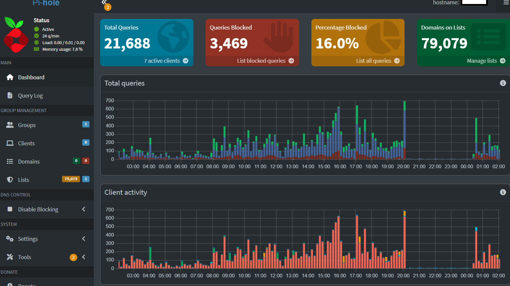
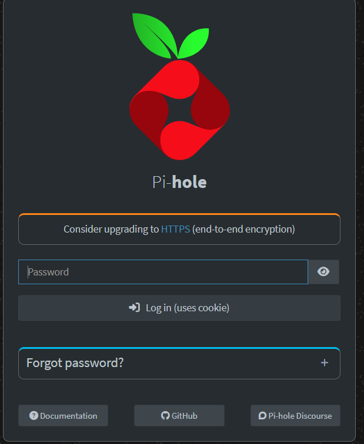
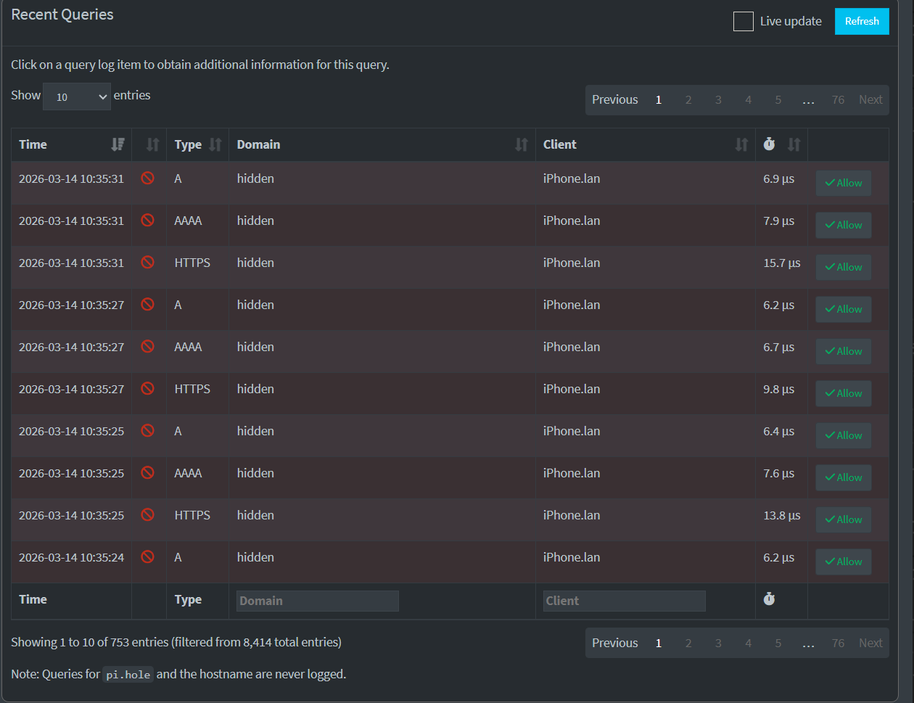
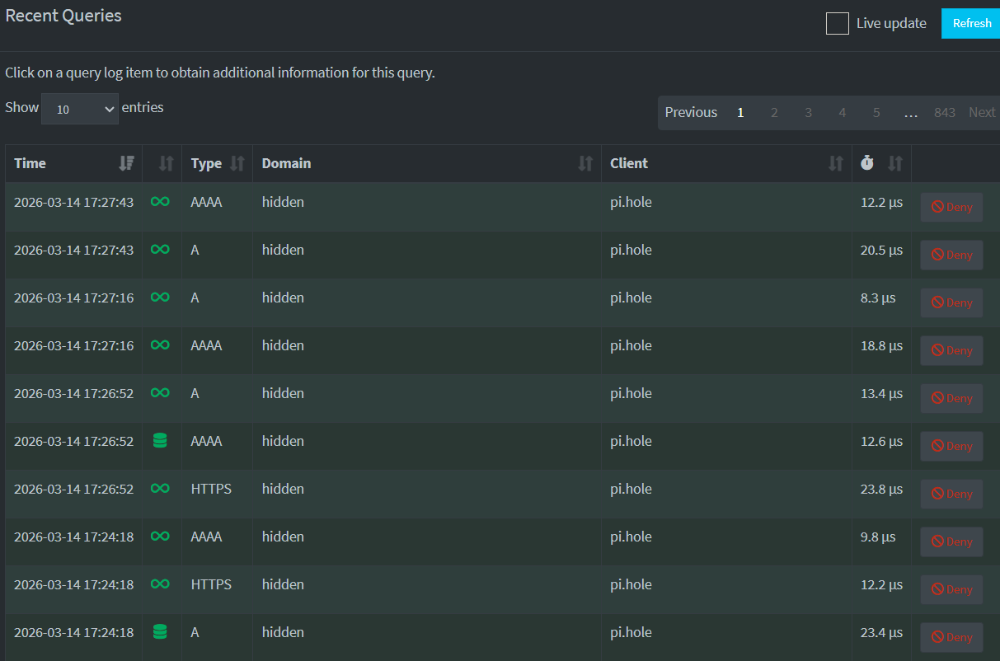
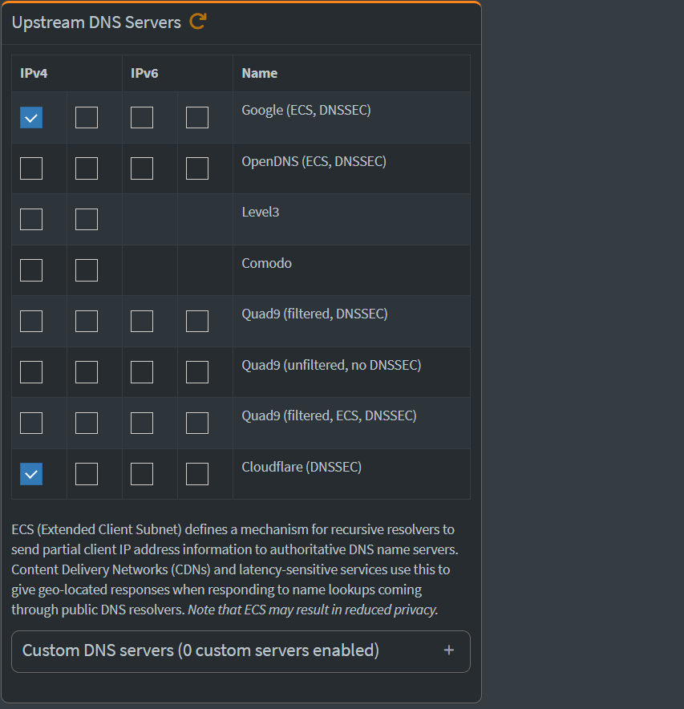
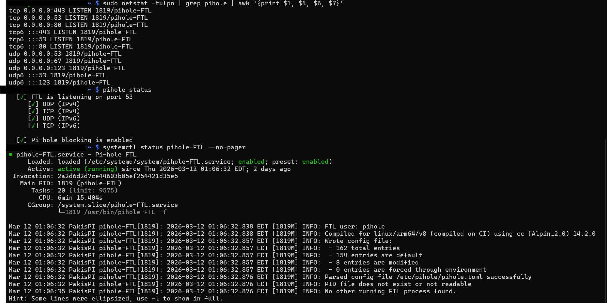
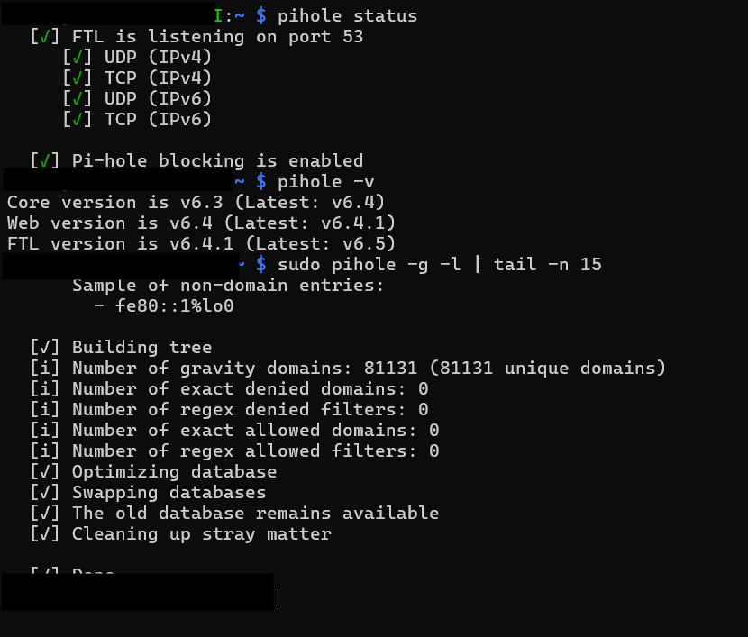

# 🍓 Pi-hole Network-Wide Ad Blocker

> DNS-level ad blocking and network traffic monitoring for all devices on your home network — powered by a Raspberry Pi.



---

## 📊 Live Stats

| Metric | Value |
|---|---|
| Total DNS Queries | 21,688 |
| Queries Blocked | 3,469 |
| Block Rate | 16.0% |
| Domains on Blocklist | 79,079 |
| Active Clients | 7 |

---

## 🔍 What Is Pi-hole?

Pi-hole is a network-level ad blocker that acts as a **DNS sinkhole** — intercepting DNS queries from every device on your network and blocking requests to known ad-serving, tracking, and malicious domains. Unlike browser extensions, Pi-hole works on **all devices and all apps** including phones, smart TVs, and IoT devices — with zero configuration on each device.

---

## ✨ Features

- **Network-wide blocking** — protects every device without installing anything on them
- **DNS-level filtering** — blocks ads in apps, not just browsers
- **Real-time query log** — see exactly what every device on your network is requesting
- **Web dashboard** — monitor statistics, manage blocklists, and configure settings from a browser
- **Upstream DNS routing** — forwards non-blocked queries to Google (8.8.8.8) and Cloudflare (1.1.1.1)
- **DNSSEC support** — validates DNS responses to prevent spoofing
- **Automatic blocklist updates** — gravity database keeps blocklists current
- **Runs 24/7 on low power** — Raspberry Pi uses only ~5W

---

## 🖥️ Screenshots

### Login Page


### Query Log — Blocked Requests
Domains flagged by the blocklist appear with a red stop icon. Domain names are hidden in this screenshot for privacy.



### Query Log — Internal Queries
Queries originating from the Pi-hole itself (shown as `pi.hole`) are resolved locally with sub-millisecond response times.



### Upstream DNS Servers
Configured to use **Google (ECS, DNSSEC)** and **Cloudflare (DNSSEC)** as upstream resolvers.



### Service Status & Listening Ports
Pi-hole FTL listens on port **53** (DNS) over UDP and TCP for both IPv4 and IPv6, port **80** (HTTP), and port **443** (HTTPS).



### Command Line Status
Pi-hole running on **Core v6.3**, blocking enabled, with **81,131 gravity domains** loaded.



---

## 🛠️ Hardware

| Component | Details |
|---|---|
| Device | Raspberry Pi (hostname: `PakisPI`) |
| Architecture | `linux/arm64/v8` |
| OS | Raspberry Pi OS |
| Storage | MicroSD |
| Power | ~5W continuous |

---

## ⚙️ Configuration

| Setting | Value |
|---|---|
| Pi-hole Core | v6.3 |
| Web Interface | v6.4 |
| FTL Engine | v6.4.1 |
| Upstream DNS | Google (ECS, DNSSEC) + Cloudflare (DNSSEC) |
| Gravity Domains | 81,131 |
| DNS Port | 53 (UDP + TCP, IPv4 + IPv6) |
| Web Port | 80 / 443 |
| Blocking Status | ✅ Enabled |
| Service Uptime | Active since 2026-03-12 |

---

## 📂 Repository Structure

```
pihole-network-monitor/
├── README.md              # This file
├── SETUP.md               # Full installation & configuration guide
├── config/
│   └── setupVars.conf     # Pi-hole configuration reference
└── screenshots/
    ├── pihole-dashboard-main.png
    ├── pihole-login-page.png
    ├── pihole-query-log-blocked.png
    ├── pihole-query-log-internal.png
    ├── pihole-dns-upstream-servers.png
    ├── pihole-listening-ports.png
    └── pihole-command-line.png
```

---

## 🚀 Quick Start

See [SETUP.md](SETUP.md) for the full installation and configuration guide.

**One-line installer:**
```bash
curl -sSL https://install.pi-hole.net | bash
```

---

## 🌐 How It Works


Every device on the network sends DNS queries to the router. The router forwards all DNS traffic to Pi-hole. Pi-hole checks each domain against its blocklist (81,131 domains) — blocked domains get an immediate `NXDOMAIN` response so the ad or tracker never loads. Allowed domains are forwarded to upstream resolvers (Google 8.8.8.8 or Cloudflare 1.1.1.1, both with DNSSEC) and the real IP is returned normally. No per-device configuration is needed.

---

## 📚 Resources

- [Pi-hole Documentation](https://docs.pi-hole.net/)
- [Pi-hole GitHub](https://github.com/pi-hole/pi-hole)
- [Firebog Blocklists](https://firebog.net/) — curated lists to expand coverage
- [Pi-hole Discourse Community](https://discourse.pi-hole.net/)

---

## 📄 License

This project documentation is open source. Pi-hole itself is licensed under the [EUPL](https://github.com/pi-hole/pi-hole/blob/master/LICENSE).